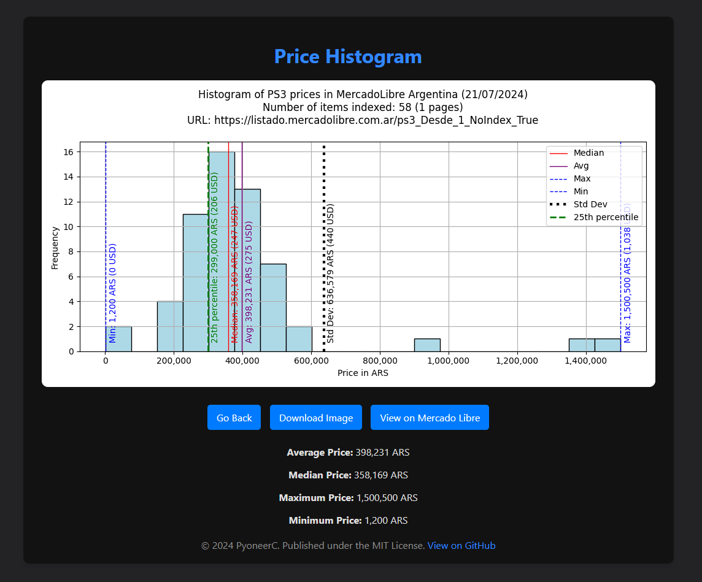
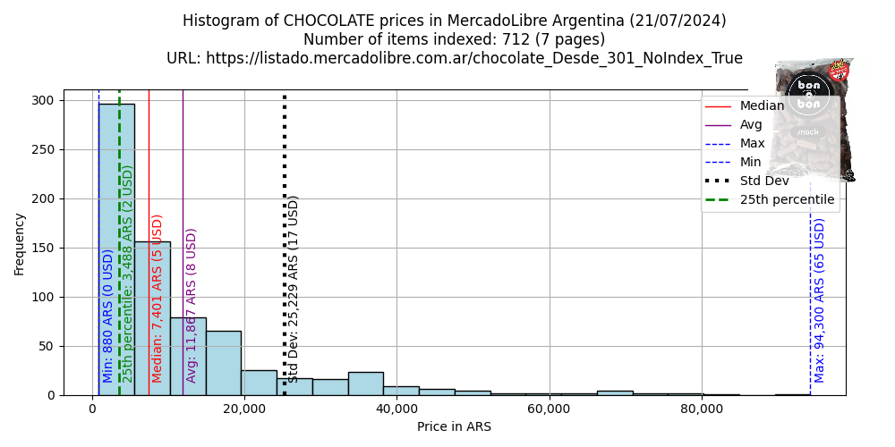

# Proyecto: MercadoLibre Price Chart

## Descripción

Este proyecto es una aplicación web desarrollada en Flask que permite a los usuarios consultar precios de productos en MercadoLibre y visualizar un histograma de precios. Utiliza la API de [DolarAPI](https://dolarapi.com/) para obtener el tipo de cambio actual y presenta los datos en gráficos generados con Matplotlib.




> [!TIP]
> Puedes poner cualquier artículo que desees en la barra de búsqueda!

## Funcionalidades

- **Consulta de Precios**: Permite al usuario ingresar el nombre de un producto y el número de páginas para consultar en MercadoLibre.
- **Generación de Gráfico**: Visualiza un histograma de los precios obtenidos, mostrando estadísticas relevantes como el promedio, la mediana, el máximo, el mínimo, y la desviación estándar.
- **Visualización de Imágenes**: Incluye una imagen representativa del primer resultado de la búsqueda en el gráfico.
- **Interfaz de Usuario**: Ofrece una interfaz simple para introducir los parámetros de búsqueda y mostrar los resultados.

## Instalación

Para ejecutar este proyecto en tu máquina local, sigue estos pasos:

1. **Clonar el Repositorio**:
   ```bash
   git clone https://github.com/tu_usuario/mercado-libre-price-chart.git
    ```
   
2. **Instalar Dependencias**:

Asegúrate de tener Python y pip instalados en tu sistema. Luego, instala las dependencias del proyecto con el siguiente comando:
   ```bash
   pip install -r requirements.txt
   ```

3. **Configurar Variables de Entorno**:

Crea un archivo `.env` en el directorio raíz del proyecto y agrega las siguientes variables:
   ```env
   FLASK_APP=app.py
   FLASK_ENV=development
   FLASK_DEBUG=0
   ```

4. **Ejecutar la Aplicación**:

Finalmente, ejecuta la aplicación con el siguiente comando:
   ```bash
   flask run
   ```

La aplicación estará disponible en `http://127.0.0.1:5000`

## Uso

1. Abre tu navegador y accede a [http://127.0.0.1:5000](http://127.0.0.1:5000).
2. En la página principal, ingresa el nombre del producto y el número de páginas que deseas consultar.

> [!WARNING]
> Cuidado con ingresar un número muy alto de páginas, ya que puede llevar varios segundos e incluso que la aplicación falle si tu internet es lento.

3. Haz clic en el botón para generar el gráfico.
4. En la página de resultados, podrás ver el histograma de precios junto con estadísticas como el precio promedio, mediano, máximo, y mínimo.



## Tecnologías Utilizadas

- **Flask**: Framework web para Python.
- **Matplotlib**: Librería para la creación de gráficos.
- **BeautifulSoup**: Biblioteca para el análisis de HTML y extracción de datos.
- **PIL (Pillow)**: Librería para el manejo de imágenes.
- **Requests**: Biblioteca para hacer solicitudes HTTP.
- **NumPy**: Biblioteca para el cálculo numérico en Python.

## Contribuciones

Este proyecto es de código abierto y las contribuciones son bienvenidas. 

## Licencia

Distribuido bajo la licencia MIT. Haz clic [aquí](LICENSE) para más información.