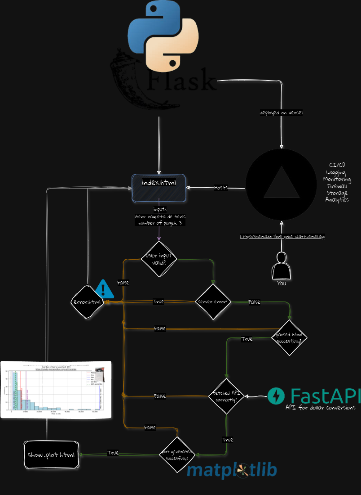

# MercadoLibre Price Chart


## Description

This project is a web application built with **Flask** that allows users to search for product prices on MercadoLibre and visualize them in a histogram. It uses web scraping to collect price data, the [monedas-api](https://github.com/pyoneerC/monedas-api) (also developed by me) for real-time currency conversion to USD, and **Matplotlib** to generate clean, insightful graphs that illustrate price variability.

> [!NOTE]  
> [Available in all modern browsers!](https://mercado-libre-price-chart.vercel.app)

  


> [!TIP]  
> You can search for any product you'd like using the search bar!


## Features

- **Price Lookup**: Enter the product name and number of pages to scrape on MercadoLibre.
- **Graph Generation**: Displays a histogram of prices, including key statistics like average, median, max, min, and standard deviation.
- **Image Display**: Shows a representative image from the first result directly on the graph.
- **User Interface**: Simple and intuitive interface for entering search parameters and viewing results.

> [!TIP]  
> You can download the histogram image by clicking the "Download Image" button.

## Installation

To run this project on your local machine, follow these steps:

1. **Clone the Repository**:
```bash
git clone https://github.com/tu_usuario/mercado-libre-price-chart.git
```
   
2. **Install Dependencies**:

Make sure you have Python and `pip` installed on your system. Then, install the project dependencies with the following command:
   ```bash
   pip install -r requirements.txt
   ```

3. **Set Up Environment Variables**:

Create a `.env` file in the root directory of the project and add the following variables:
   ```env
   FLASK_APP=app.py
   FLASK_ENV=development
   FLASK_DEBUG=0
   ```

4. **Run the Application**:

Finally, run the application with the following command:
   ```bash
   flask run
   ```

The application will be available at `http://127.0.0.1:5000`

> [!WARNING]  
> Be cautious when requesting a high number of pages — the operation may take several seconds to complete.

> [!CAUTION]  
> Try to be as specific as possible with your search to get more accurate results. You can check the data source by clicking the **"View on MercadoLibre"** button.


## Technologies Used

- **Flask**: Web framework for Python.
- **Matplotlib**: Library for creating visualizations.
- **BeautifulSoup**: Library for parsing HTML and extracting data.
- **Requests**: HTTP library for sending and receiving data.
- **NumPy**: Library for numerical computing in Python.

## Flow Diagram



## Contributions

This is an open-source project, and contributions are welcome!

## License

This project is licensed under the **MIT License**. For more information, see the [LICENSE](LICENSE) file.